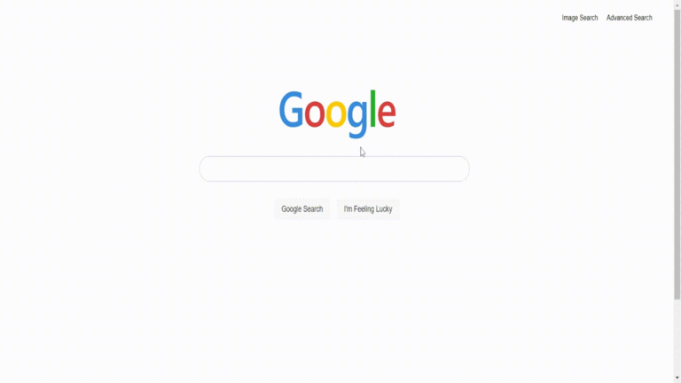

# Google Search

## Table of Contents
- [Description](#description)
- [Features](#features)
- [Requirements](#requirements)
- [CSS Styling](#css-styling)
- [Notes](#notes)
- [Usage](#usage)
- [License](#license)
- [Screenshot](#screenshot)
- [Deployed App](#deployed-app)

## Description

This is a replica of the Google Search interface built as part of a coding exercise. The website mimics the functionality and design of Google's search pages including regular search, image search, and advanced search.

## Features

- **Regular Google Search**: Allows users to enter a query and perform a Google search.
- **Image Search**: Enables users to search for images using Google's image search functionality.
- **Advanced Search**: Provides users with advanced search options similar to Google's advanced search page.
- **Navigation**: Users can easily navigate between the different search pages with links provided in the upper-right corner of each page.
- **I'm Feeling Lucky**: An "I'm Feeling Lucky" button is available on the main Google Search page, allowing users to directly go to the first search result for their query.

## Requirements

- The website contains at least three pages: `index.html` for regular Google Search, `images.html` for Google Image Search, and `advanced.html` for Google Advanced Search.
- The search bar and button resemble Google's design with rounded corners and centered alignment.
- Advanced search options are stacked vertically with left-aligned text fields.
- The "Advanced Search" button has blue background and white text.
- Clicking on the "Advanced Search" button redirects users to the search results page.
- Clicking on the "I'm Feeling Lucky" button takes users directly to the first search result, potentially encountering a redirect notice due to Google's security feature.

## CSS Styling

The CSS styling of the website follows Google's aesthetics to closely resemble the original design.

## Notes

- Users may encounter a redirect notice when using the "I'm Feeling Lucky" button, which is expected behavior due to Google's security feature.

## Usage

Simply open the respective HTML files (`index.html`, `images.html`, `advanced.html`) in a web browser to access the different search pages.

## License

This project is licensed under the terms of the MIT license.

## Screenshot

## Deployed App

[Link to Deployed App](https://msalarzon.github.io/google-search/index.html)

## Disclaimer

This project is for educational purposes only. It is not affiliated with or endorsed by Google. Google is a registered trademark of Google LLC. This project is intended to demonstrate coding skills and is not intended for commercial use or copyright infringement.
